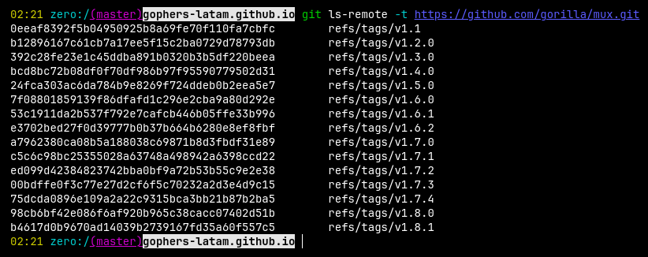



Digamos que se quiere saber qué versiones de un paquete de terceros están disponibles. En relación a la posibilidad de actualizar una dependencia principal o degradar a una version anterior por incompatilidad de cambios. 

<!--more-->

Gracias al ***go.mod*** que lista las dependencias y versiones en uso sirve para comparar con un comando de git de listado remoto de las versiones de los paquetes que se necesiten revisar, solo que colocando la URI para que sea valida para git. Esto es usando ***git ls-remote -t*** para enumerar todas las versiones, o ***git ls-remote -h*** para enumerar todas las ramas del repositorio. Alternativamente, para confirmar fuera de la terminal se puede ir al sitio web de GitHub, GitLab, etc. y navegar hasta poder ver las etiquetas o ramas.

Esto no es exactamente algo puramente de Go, pero es un consejo útil para determinar las versiones de paquetes disponibles aprovechando **git** sin reinventar la rueda.

**Ejemplo:**

Suponiendo que se necesita conocer las versiones y ramas disponibles si se desea utilizar versiones que no sean las más recientes del paquete. Entonces con **ls-remote** como se meciono se pueden ver las etiquetas y los encabezados, respectivamente. En Git, las etiquetas se utilizan a menudo para marcar lanzamientos o versiones. Las cabeceras son las puntas de las ramas, por lo que las cabeceras representan las ramas disponibles del repositorio.

Por ejemplo, ejecutando esto desde la línea de comando para enumerar todas las versiones en **gorilla/mux**:

```sh
$ git ls-remote -t https://github.com/gorilla/mux.git
```

Mostraria algo como:



Si se está utilizando GitHub o GitLab o algún otro SaaS que proporcione un servicio de repositorio de código, git también puede ir al sitio y encontrar las etiquetas o ramas a mostrar.