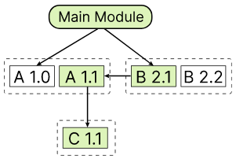



Esta es una hoja de trucos esenciales, no una referencia oficial. Con el fin de que sea conciso, se omitieron aspectos menos frecuentes, dado que este sitio desde su [repositorio](https://github.com/gophers-latam/gophers-latam.github.io) esta abierto a cambios de contribuidores en la comunidad de **Gophers LATAM** cualquiera puede hacer cambios que mejoren este contenido.

<!--more-->

## Inicio rápido

### Gestión de dependencias
```shell
go get -d github.com/path/to/module       # agregar o actualizar dep (-v log verboso)
go get -d github.com/dep/two/v2@v2.1.0    # usar una versión específica
go get -d github.com/dep/commit@branch    # usar una rama específica
go get -d -u ./...                        # actualizar módulos utilizados en subdirectorios

go get -d github.com/dep/legacy@none      # eliminar dep
```

### Comandos útiles
```shell
go mod tidy                               # organizar y limpiar go.mod and go.sum
go mod download                           # descargar deps en caché de módulos
go mod init github.com/path/to/module     # inicializar nuevo módulo
go mod why -m github.com/path/to/module   # por qué el módulo es una dependencia?
go install github.com/path/to/bin@latest  # construir e instalar binario
```

## Anatomía del go.mod

```go
// ruta de importación de Go con lugar donde se aloja el módulo
module github.com/my/library

go 1.16 // versión utilizada para desarrollar módulo (usar nuevas funciones de lenguaje)

require (
    github.com/dep/one    v1.0.0
    // v2 y posteriores tienen versión principal en ruta del módulo
    github.com/dep/two/v2 v2.3.0

    // "pseudo-versión" que se refiere a un commit y no a una versión etiquetada.
    github.com/dep/other v0.0.0-20180523231146-b3f5c0f6e5f1
    github.com/dep/legacy v2.0.0+incompatible
    // "incompatible" significa que el paquete aún no se ha migrado a nuevos módulos de Go
)

exclude github.com/dep/legacy v1.9.2 // evitar que se use una versión de módulo específica

replace github.com/dep/one => github.com/fork/one // reemplazar este módulo con este otro
```

## Selección de versión mínima (MVS)

Para crear un programa, Go necesita saber exactamente qué dependencias necesita y qué versión usar.

Go utiliza MVS como una forma sencilla y predecible de decidir qué versión utilizar.

Funciona así:

- El módulo desde el que está ejecutando es el "módulo main"

- Encuentra todas las dependencias que necesita el módulo principal (de forma recursiva, usando los archivos **go.mod** de las dependencias)

- Para cada dependencia, usar la mayor versión que cualquier **go.mod** haya especificado explícitamente

### Ejemplo:



En este ejemplo, el módulo principal depende de **A 1.0** y **B 2.1**.

Dado que **B 2.1** depende de **A 1.1**, esta es la versión de **A** que se utilizará.

Dado que se usa **A 1.1**, también en **C 1.1**.

La lista final de dependencias es:

* **A 1.1**
* **B 2.1**
* **C 1.1**

## Fuentes:

- Referencia oficial: **https://golang.org/ref/mod**

- Versión del post original: **https://encore.dev/guide/go.mod**